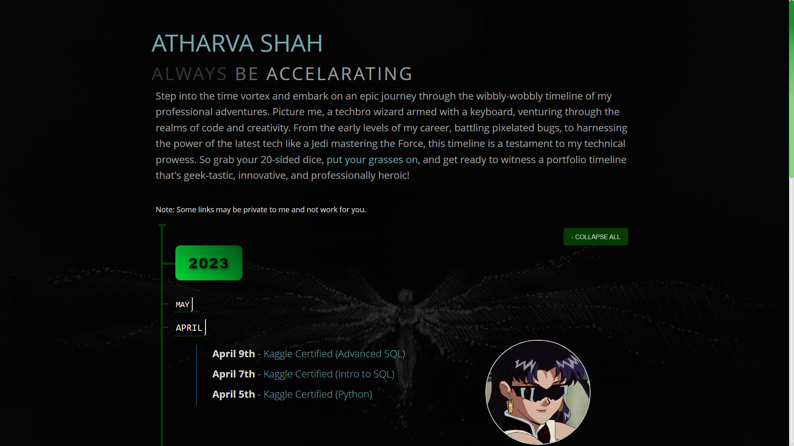

# Timeline Generator

This is a simple timeline generator that uses HTML, CSS, and JavaScript. It is designed to be easy to use and modify. You place your data in the `data.js` file and the generator will create the timeline for you. Can easily be published on GitHub Pages/Netlify. No server-side code required. Extendable and customizable. Go to css/timeliner-future.css to change the colors and fonts.



## Setup

Modify the `data.js` file to include your own data. The data should be an array of objects (like JSON).  

- Links can be left blank, but you must include the keys.
- Images to be placed in the img folder.
See below for an example of the data structure.

```javascript
const timelineData = {
    "timeline": [
        {
            "year": "2023",
            "months": [
                {
                    "monthName": "April",
                    "monthImage": "img/2023-april.jpg",
                    "events": [
                        {
                            "date": "April 9th",
                            "description": "Kaggle Certified (Advanced SQL)",
                            "link": "https://www.kaggle.com/learn/certification/highnessatharva/advanced-sql"
                        },
                        {
                            "date": "April 7th",
                            "description": "Kaggle Certified (Intro to SQL)",
                            "link": "https://www.kaggle.com/learn/certification/highnessatharva/intro-to-sql"
                        },
                        {
                            "date": "April 5th",
                            "description": "Kaggle Certified (Python)",
                            "link": "https://www.kaggle.com/learn/certification/highnessatharva/python"
                        }

                    ]
                },
                {
                    "monthName": "March",
                    "monthImage": "img/2023-march.jpg",
                    "events": [
                        {
                            "date": "DATE",
                            "description": "EVENT",
                            "link": ""
                        }
                    ]
                },
                {
                    "monthName": "February",
                    "monthImage": "img/2023-february.jpg",
                    "events": [
                        {
                            "date": "DATE",
                            "description": "EVENT",
                            "link": ""
                        }
                    ]
                },
                {
                    "monthName": "January",
                    "monthImage": "img/2023-january.jpg",
                    "events": [
                        {
                            "date": "DATE",
                            "description": "EVENT",
                            "link": ""
                        }
                    ]
                }
            ]
        },
        {
            "year": "2022",
            "months": [
                {
                    "monthName": "December",
                    "monthImage": "img/2022-december.jpg",
                    "events": [
                        {
                            "date": "DATE",
                            "description": "EVENT",
                            "link": ""
                        },
                        {
                            "date": "DATE",
                            "description": "EVENT",
                            "link": ""
                        }
                    ]
                }
            ]
        }
    ]
}

```
